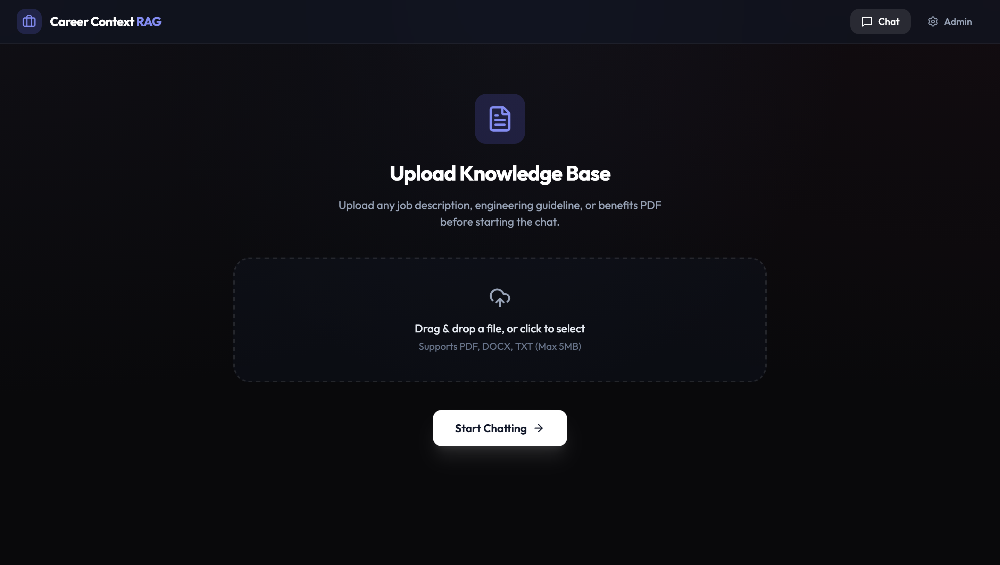
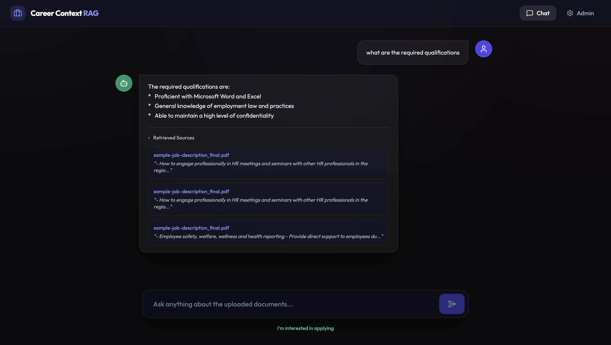
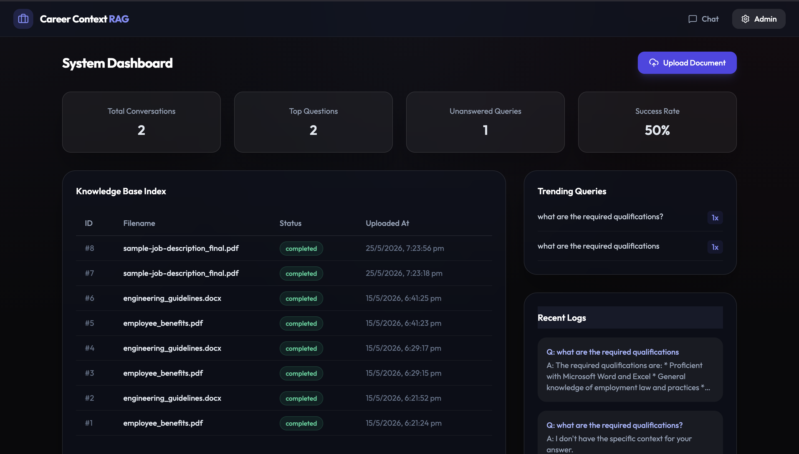

# CareerContext (Enterprise AI Career Assistant Production-Grade RAG Platform)

An asynchronous, production-ready Retrieval-Augmented Generation (RAG) platform that provides candidates with instant, high-context insights into roles, benefits, interview processes, and corporate policies. Engineered with a completely decoupled, containerized microservices architecture, this platform enforces absolute local context grounding to eliminate LLM hallucinations while isolating heavy mathematical and file-parsing workloads from the user-facing web API.


---

##  Screenshots

### Upload


### Chat


### Admin Page


---

##  System Architecture & Data Flow

The platform separates the **Web Brain** from the **Mathematical Workforce** to guarantee zero CPU starvation and optimal API responsiveness under high load:

1. **Client Tier:** A responsive React Single Page Application (SPA) compiled with Vite, handling interactive state management, multi-turn chat sessions, and asynchronous multipart file uploads.
2. **Web API Tier:** A high-throughput FastAPI server driving non-blocking asynchronous HTTP routing. It serves as a task producer, instantly offloading heavy logic to the message broker while committing shallow metadata to PostgreSQL.
3. **Message Broker / Caching Tier:** A Redis container serving a dual purpose: acting as a high-speed FIFO task broker queue for Celery, and managing an independent in-memory data store for semantic query caching.
4. **Asynchronous Worker Tier:** A completely isolated background Celery Worker environment dedicated to heavy-duty Python computation (extracting PDF strings, mathematical text-splitting, tokenizing, and calculating embedding structures).
5. **Data Engine Tier:** A relational PostgreSQL database housing structured schemas (Document metadata, raw Text Chunks, Recruiter Leads, and Conversation Logs) running adjacent to a containerized FAISS (Facebook AI Similarity Search) binary vector database.

---

## Key Engineering Features & Implementations

### 1. Decoupled Task Ingestion (Asynchronous Pipelines)
* **What it does:** Allows users to upload multi-page corporate PDFs without causing the web application UI or API to freeze.
* **How it works:** When a PDF is received, FastAPI generates a unique `document_id` in PostgreSQL, saves the raw file to a shared Docker disk volume, drops a lightweight JSON payload into the Redis broker queue, and instantly returns a `202 Accepted` status. A background Celery worker picks up the job out-of-process, runs the file extraction, and writes the chunks completely independent of the API server loop.

### 2. State-Synchronized Hybrid Retrieval (FAISS + BM25 + RRF)
* **What it does:** Combines exact keyword matches with deep contextual meaning for optimal query-to-chunk matching.
* **How it works:** - **Vector Search:** Uses `FastEmbed` to generate dense queries, normalized via `faiss.normalize_L2` to switch FAISS math into explicit **Cosine Similarity (via `IndexFlatIP`)** to provide a strict similarity metric scale bounded between `0.0` and `1.0`.
  - **Keyword Search:** Uses `BM25Okapi` to capture absolute terminology constraints (e.g., specific salary figures or exact role titles).
  - **Fusion:** Merges both candidate lists using **Reciprocal Rank Fusion (RRF)** to accurately weigh and rank the top relevant text segments.
  - **Live State Sync:** Because FastAPI and Celery run in distinct container filesystems, the retrieval engine utilizes a specialized *disk-reconciliation hook* that dynamically loads the latest raw `index.faiss` binary file from the shared volume on every incoming chat query, solving container state-disconnects.

### 3. Strict Anti-Hallucination Gatekeeper
* **What it does:** Prevents the system from making up false professional facts or leaking generalized public knowledge, protecting the platform from hallucinated answers.
* **How it works:** Evaluates the best available chunk outputs from the RRF loop. If a user’s query contains zero keyword overlap (`best_bm25 == 0.0`) and drops below an explicit semantic confidence threshold (`best_faiss < 0.50`), the platform aggressively stops execution. It returns a standardized fail-safe fallback message instantly, saving money on unnecessary LLM API usage.

### 4. Idempotent Ingestion via Cryptographic Hashing
* **What it does:** Prevents duplicate chunks and overlapping vectors from cluttering data store volumes if a file is re-uploaded.
* **How it works:** Inside the background worker pipeline, the extracted PDF text is serialized and transformed into an MD5 cryptographic hash (`hashlib.md5`). Before chunking, the worker cross-references this signature against PostgreSQL. If a matching hash already exists under a `completed` document status, it flags the file as a duplicate, deletes the temporary file to preserve space, and breaks execution cleanly.

### 5. In-Memory Sub-Millisecond Caching
* **What it does:** Instantly returns answers to frequently or identical questions without performing vector database math or invoking the LLM.
* **How it works:** Leverages an isolated database index inside Redis (`db=1`). When a query hits the API, a fast key lookup checks the Redis memory space. On a cache hit, the grounded JSON answer is returned in less than 2 milliseconds. On a cache miss, the RAG loop runs normally, and successful ground truth outcomes are cached with an explicit Time-To-Live (TTL) expiration window.

### 6. Recruiter Dashboard & Lead Acquisition
* **What it does:** Bridges the gap between candidate inquiries and direct recruitment acquisition.
* **How it works:** Features an automated lead-capture endpoint that converts candidate interest actions into a structured database record. Includes a secure metrics dashboard accessible at `/admin` to query analytics data, monitor success metrics, isolate low-confidence unanswered queries, and track real-time recruitment funnels.

---

## 🛠️ How to Use the App

1. **Access the Frontend Interface:** Open your web browser and navigate to the [Live Frontend Deployment URL](https://ai-chatbot-application-status.vercel.app/). No account registration or login sequences are required.
2. **Seed Knowledge Base Context:** Move to the document upload screen and provide company context files such as your corporate policy documentation, human resources benefit guidelines, or upcoming technical job specifications.
3. **Engage with the Assistant:** Switch back to the conversational panel and test the platform’s localized reasoning constraints. Try submitting real-world programmatic inquiries such as:
   - *"What’s the starting salary matrix for a Backend Engineer?"*
   - *"What are the medical and lifestyle benefits provided at Vertex Labs?"*
   - *"Describe the comprehensive phase-by-phase interview process for a Product Manager."*
4. **Trigger Lead Submission:** If a specific job or policy aligns with your background, interact with the **Interested** CTA button. Enter your email profile and target title to log your information into the recruitment lead console.
5. **Review Administrative Analytics:** Append `/admin` to your client browser route to review live metrics, see overall answer success counts, and track what questions candidates are asking most frequently.

---

## Local Development (Orchestrated Infrastructure)

Thanks to Docker Compose integration, you do not need to install system level setups of Node.js, Python, PostgreSQL, or Redis servers natively on your host machine. The entire infrastructure boots up fully networked inside isolated system boxes with a single terminal command.

### Technical Prerequisites
- **Docker Engine** and **Docker Compose** installed globally.
- A functional **Google Gemini API Key**.

### 1. Environmental Configuration
Create an operational environment variables file named exactly `.env` in the **absolute root directory** (the parent folder housing both the `backend/` and `frontend/` directories):

```env
GEMINI_API_KEY=your_actual_google_gemini_api_key_here
```

###2. Provision and Run the Container Stack

Open your host system terminal inside the absolute root project directory and execute the multi-container startup sequence:
Bash

docker compose up --build

Docker Compose will systematically download official system layers for PostgreSQL and Redis, build your customized application layers for both your FastAPI API and Celery Worker environments using a unified Dockerfile blueprint, provision virtual local network bridges, mount storage drives, and stream all server outputs into your consolidated command prompt view.
Client UI Interface: http://localhost:5173

Automated OpenAPI Web Documentation: http://localhost:5001/docs

Recruiter Analytics Workspace: http://localhost:5173/admin
---
*Engineered for secure, scalable, and contextually absolute candidate engagement.*
